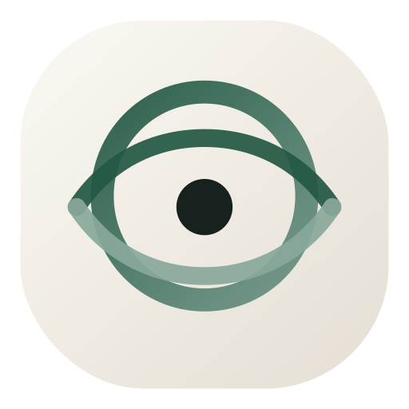

<!-- LOGO -->
<h1>

  
   Onde Inference
</h1>
  

    <strong>On-device inference engine optimized for <a href="https://en.wikipedia.org/wiki/Apple_silicon" target="_blank">Apple silicon</a>.</strong>
     
     
    <a href="#in-production">In Production</a>
    ·
    <a href="https://ondeinference.com">Website</a>
    ·
    <a href="https://apps.apple.com/se/developer/splitfire-ab/id1831430993" target="_blank">App Store</a>
  

## In production

Onde already powers real apps on the App Store across multiple AI workloads.

### Chat completion
- [Karokowe](https://apps.apple.com/se/app/karaoke-karokowe/id6756801861)
- [Reimagen](https://apps.apple.com/se/app/reimagen-ai-musik-till-konst/id6757844075)
- [GT8](https://apps.apple.com/se/app/gt8-kord-gitar-tutorial/id6756177644)
- [Splitfire](https://apps.apple.com/se/app/splitfire-bassndrums/id6751143237)
- [Rumi – Lär dig persiska](https://apps.apple.com/se/app/rumi-l%C3%A4r-dig-persiska/id6753832408)

### Image generation
- [Reimagen](https://apps.apple.com/se/app/reimagen-ai-musik-till-konst/id6757844075)

### Audio transcription
- [Karokowe](https://apps.apple.com/se/app/karaoke-karokowe/id6756801861)

### AI coding agent (WIP)
- [Sigit](https://apps.apple.com/se/app/sigit-git-client-code-editor/id6753018849)

  

---

## Copyright

  2026 <a href="https://ondeinference.com">Onde Inference</a>

