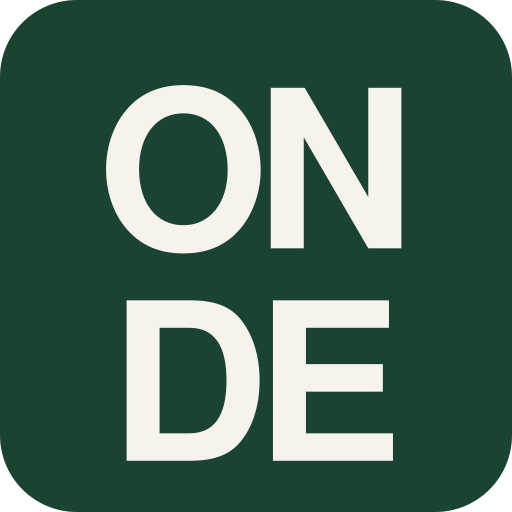

<p align="center">
  
</p>

<h1 align="center">Onde Inference</h1>

<p align="center">
  <strong>Run LLMs on-device with <a href="https://ondeinference.com/">Onde Inference</a>, with first-class support for <a href="https://en.wikipedia.org/wiki/Apple_silicon">Apple silicon</a>.</strong>
</p>

<p align="center">
  <a href="https://crates.io/crates/onde"></a>
  <a href="https://central.sonatype.com/artifact/com.ondeinference/onde-inference"></a>
  <a href="https://swiftpackageindex.com/ondeinference/onde-swift"></a>
  <a href="https://pub.dev/packages/onde_inference"></a>
  <a href="https://www.npmjs.com/package/@ondeinference/react-native"></a>
  <a href="https://ondeinference.com"></a>
  <a href="https://apps.apple.com/se/developer/splitfire-ab/id1831430993"></a>
</p>

<p align="center">
  <a href="https://github.com/ondeinference/onde-swift">Swift SDK</a> · <a href="https://central.sonatype.com/artifact/com.ondeinference/onde-inference">Kotlin Multiplatform SDK</a> · <a href="https://pub.dev/packages/onde_inference">Flutter SDK</a> · <a href="https://www.npmjs.com/package/@ondeinference/react-native">React Native SDK</a> · <a href="https://ondeinference.com">Website</a>
</p>

---

## In production

Onde is already shipping in real apps on the App Store and Google Play. Chat runs fully on-device, so there is no server round trip and no user data leaving the device. For SDK docs, platform notes, and setup details, see <https://ondeinference.com/sdk>. If you want to test downloads, model selection, or GGUF export before wiring the engine into app code, use [Onde CLI](https://github.com/ondeinference/onde-cli).

**[Siti AI](https://github.com/ondeinference/siti)** is the flagship open reference app — a private, on-device assistant built on Onde, open source under Apache-2.0. Its source is a complete, readable example of wiring the engine into a shipping [Tauri](https://tauri.app) app across macOS, iOS, and Android.

<p align="left">
  <a href="https://apps.apple.com/se/app/siti-ai/id6780047972" target="_blank">
    
  </a>
  &nbsp;
  <a href="https://play.google.com/store/apps/details?id=ai.siti.Siti" target="_blank">
    
  </a>
</p>

---

## Model formats

Onde can load GGUF models and UQFF models through the same chat engine. UQFF is mistral.rs' native pre-quantized format: pass the base repository or local model directory for tokenizer/config resolution, plus the first UQFF shard or shorthand.

```rust
use onde::inference::{ChatEngine, UqffModelConfig};

let engine = ChatEngine::new();
engine
    .load_uqff_model(
        UqffModelConfig {
            model_id: "google/gemma-4-E4B-it".into(),
            files: vec!["q4k-0.uqff".into()],
            display_name: "Gemma 4 E4B (UQFF Q4K)".into(),
            approx_memory: "~2.5 GB (UQFF Q4K)".into(),
            chat_template: None,
        },
        None,
        None,
    )
    .await?;
```

For sharded UQFFs, passing the first shard is enough; mistral.rs discovers sibling shards with the same prefix.

---

## License

Onde is dual-licensed under **MIT** and **Apache 2.0**. You may use it under either license at your option.

- [MIT License](LICENSE-MIT)
- [Apache License 2.0](LICENSE-APACHE)

### Dependency attribution

| Dependency | License | Author |
|---|---|---|
| [mistral.rs](https://github.com/EricLBuehler/mistral.rs) | MIT | Eric Buehler |
| [UniFFI](https://github.com/mozilla/uniffi-rs) | MPL-2.0 | Mozilla |
| [tokio](https://github.com/tokio-rs/tokio) | MIT | Tokio contributors |

### Model licenses

Models downloaded by Onde have their own licenses independent of this crate. By using Onde, you are also subject to the license of the model you load:

| Model | Size | License | Commercial use |
|---|---|---|---|
| Qwen 2.5 1.5B Instruct (GGUF Q4_K_M) | ~941 MB | [Qwen Community License](https://huggingface.co/Qwen/Qwen2.5-1.5B-Instruct/blob/main/LICENSE) | ✅ with conditions¹ |
| Qwen 2.5 3B Instruct (GGUF Q4_K_M) | ~1.93 GB | [Qwen Community License](https://huggingface.co/Qwen/Qwen2.5-3B-Instruct/blob/main/LICENSE) | ✅ with conditions¹ |
| Qwen 2.5 Coder 7B Instruct (GGUF Q4_K_M) | ~4.4 GB | [Qwen Community License](https://huggingface.co/Qwen/Qwen2.5-Coder-7B-Instruct/blob/main/LICENSE) | ✅ with conditions¹ |
| Qwen 3 1.7B (GGUF Q4_K_M) | ~1.3 GB | [Apache 2.0](https://huggingface.co/Qwen/Qwen3-1.7B/blob/main/LICENSE) | ✅ |
| Qwen 3 4B (GGUF Q4_K_M) | ~2.7 GB | [Apache 2.0](https://huggingface.co/Qwen/Qwen3-4B/blob/main/LICENSE) | ✅ |
| Qwen 3 8B (GGUF Q4_K_M) | ~5 GB | [Apache 2.0](https://huggingface.co/Qwen/Qwen3-8B/blob/main/LICENSE) | ✅ |
| Qwen 3 14B (GGUF Q4_K_M) | ~8.4 GB | [Apache 2.0](https://huggingface.co/Qwen/Qwen3-14B/blob/main/LICENSE) | ✅ |
| DeepSeek Coder 6.7B Instruct (GGUF Q4_K_M) | ~3.8 GB | [DeepSeek License v1.0](https://huggingface.co/deepseek-ai/deepseek-coder-6.7b-instruct/blob/main/LICENSE) | ✅ with conditions² |

¹ **Qwen Community License conditions:** no training of competing models, attribution required, no misrepresentation of origin. Organisations with more than 100 million monthly active users must obtain a separate commercial licence from Alibaba Cloud.

² **DeepSeek License v1.0 conditions:** use-based restrictions apply (see Attachment A of the license). Prohibits military use, generation of disinformation, and certain other uses. Governing law is PRC law.

Onde's own license (MIT OR Apache-2.0) is independent of these model licenses. If you build an application on top of Onde, you are responsible for complying with the license of whichever model your users load.

---

## Copyright

© 2026 [Splitfire AB](https://5mb.app) ([Onde Inference](https://ondeinference.com)).
